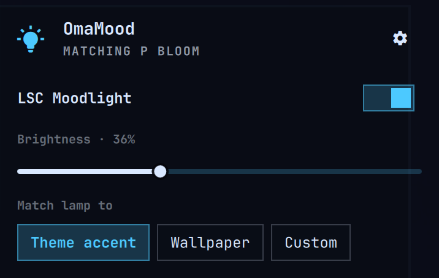

# OmaMood

Control your Tuya Wi-Fi lamp from the [Omarchy](https://omarchy.org) bar: power,
brightness and colour. The lamp can match your wallpaper or theme accent every
time you change themes, and it switches off while the computer sleeps, coming
back as it was when it wakes.

<p align="center"></p>

- **Local.** Commands go straight to the lamp over your home network. The cloud
  is used once during setup, to fetch the lamp's key, and logged out right after.
- **No developer account.** Setup is one QR scan in the Smart Life app.
- **Nothing to install.** It only uses what Omarchy already ships: Python 3
  (standard library), ImageMagick and qrencode.

## What you need

- Omarchy.
- A Wi-Fi lamp that works with the **Smart Life** or **Tuya Smart** app (or a
  rebrand of it, like LSC Smart Connect), already paired on your phone.
- The lamp and this computer on the same network (not a guest network).

Tested on the LSC Mood Light; other Tuya lights should work too. See
[Lamps](#lamps).

## Install

```bash
omarchy plugin add https://github.com/defkode/omarchy-moodlight --enable
```

A bulb icon appears in the bar.

## Set up

1. In the Smart Life app, find your **User Code**:
   **Me → ⚙ Settings → Account and Security → User Code**.
2. Click the bulb in the bar. Type the User Code and press **Show QR**.
3. In the app, tap **+ → Scan**, scan the QR code, and tap **Confirm login**.
   - The app calls this login "Home Assistant". That's expected: OmaMood signs
     in the same way Home Assistant's official Tuya integration does, which is
     why no developer account is needed. You can remove "Home Assistant" from
     the app afterwards; your lamps keep working.
4. OmaMood finds your lamps on the network and adds them. Devices that aren't
   lights (plugs, sensors) are skipped.
5. If the panel says **"Theme hook not installed"**, click **Install**. This lets
   the lamp follow theme changes.

That's it. The lamp's key is stored in `~/.config/omamood/devices.json`,
readable only by you.

## Use

### The bar icon

- **Click** opens the panel. **Right-click** turns the lamps on or off.
  **Scroll** changes brightness.
- The bulb takes the lamp's colour.

### The panel

- **Power** switch and **brightness** slider for each lamp.
- **Match lamp to** decides what happens when you change themes:
  - **Theme accent**: the lamp takes the theme's accent colour.
  - **Wallpaper**: the lamp takes the new wallpaper's main colour.
  - **Custom**: theme changes leave the lamp alone, and you pick the colour from
    the swatches: white (the lamp's warm white), your theme's colours, or
    **Wallpaper** for the current wallpaper's colour.
- **⚙ (top right)** opens lamp management; click it again to go back:
  - add more lamps (QR again), or remove one (**Remove**, then **Confirm?**);
  - **Find lamps** finds lamps again if one shows *Offline*, for example after
    your router gave it a new address.
- Keyboard: `Space` toggles power, `←` `→` change brightness, `Esc` closes.

Lamps that are off stay off when you change themes. Muted theme colours are
made a little more saturated so they still look like a colour on an LED, and
grey wallpapers give white. The lamp follows **theme** changes; changing only
the wallpaper doesn't recolour it yet ([#1](https://github.com/defkode/omarchy-moodlight/issues/1)).

### Sleep

Before the computer suspends, the lamps switch off. When it wakes, they come
back exactly as they were.

### Keybindings (optional)

Plugins can't add keybindings themselves. To add some, paste these into
`~/.config/hypr/bindings.lua`:

```lua
o.bind("SUPER + ALT + L", "Toggle lamps", "omarchy-shell -q omamood toggle")
o.bind("SUPER + ALT + SHIFT + L", "Lamps panel", "omarchy-shell shell toggle io.github.defkode.omamood")
```

Other actions you can bind the same way: `on`, `off`, `brighter`, `dimmer`,
`white`, `wallpaper`, `accent`, `blink`, and `color '#ff8800'`.

### Command line (optional)

```bash
alias omamood=~/.config/omarchy/plugins/io.github.defkode.omamood/omamood

omamood status
omamood on | off | toggle
omamood brightness 40             # or +10 / -10
omamood color orange              # a name or '#ff8800'
omamood white
omamood timer 30                  # turn off in 30 minutes
omamood blink                     # e.g. make && omamood blink
omamood remove "Desk lamp"        # forget a lamp
omamood status --json             # for scripts and AI agents
```

`--lamp NAME` picks one lamp; without it, commands go to all of them.
`omamood --help` lists everything.

## Settings

Most people only need the panel. Everything can also be set with
`omarchy bar set io.github.defkode.omamood <key> <value>`:

| Setting | Default | What it does |
|:--|:--|:--|
| `colorSource` | `accent` | **Match lamp to**: `accent`, `wallpaper` or `off` (Custom) |
| `saturationFloor` | `70` | how much (%) muted theme colours are boosted |
| `sleepAction` | `off` | `off`: lamps off during sleep. `none`: leave them alone |
| `tintIcon` | `true` | colour the bar icon like the lamp |

## Update and remove

```bash
omarchy plugin update io.github.defkode.omamood && omarchy restart shell
omarchy plugin remove io.github.defkode.omamood
```

Removing the plugin leaves `~/.config/omamood/` (your lamps and keys) in place;
delete that folder too if you want them gone.

## Lamps

| Lamp | Tuya protocol | Tested by | Notes |
|:--|:--|:--|:--|
| LSC Smart Connect Mood Light RGB+WW (Action 3204432) | 3.3 | @defkode | white is fixed at 3000K |
| Other Tuya lights with the standard data points (20-28) | 3.3 | — | generic profile `tuya-light-v2` |
| Older Tuya bulbs (data points 1-5) | 3.3 | — | generic profile `tuya-light-v1` |

Lamps using Tuya protocol 3.4 or 3.5 aren't supported yet. During setup they
show up as not found.

Yours works too? Add it to this table: see
[docs/ADDING_DEVICES.md](docs/ADDING_DEVICES.md), or ask your coding agent to
use the `add-device` skill.

## Troubleshooting

- **"Can't reach it":** OmaMood keeps retrying and, if the lamp got a new IP
  address, finds it by itself; **Retry** does it immediately. If it still can't
  find it, the lamp isn't on your Wi-Fi: unplug it for 10 seconds, or check it
  shows as online in the Smart Life app. A fixed IP (DHCP reservation in your
  router) avoids address changes altogether.
- **No lamps found during setup:** make sure the lamp and the computer are on the
  same network. Firewalls are fine: OmaMood only makes outgoing connections.
- **The lamp doesn't follow theme changes:** check **Match lamp to** isn't
  *Custom*, and click **Install** if the panel says "Theme hook not installed".
- **You re-paired the lamp in the app:** its key changes. Remove it under **⚙**
  and add it again with the QR code.
- **Something else:** `omarchy-shell omamood status | python3 -m json.tool`
  shows what the plugin sees, and `journalctl -t omarchy-shell | grep -i omamood`
  its log.

## Contributing

Run `tools/check` before sending changes. [AGENTS.md](AGENTS.md) is the short
guide for people and coding agents; [BRIDGE.md](BRIDGE.md) describes the helper
process; [docs/ADDING_DEVICES.md](docs/ADDING_DEVICES.md) covers new lamps.

MIT licence. The Tuya protocol work builds on
[tinytuya](https://github.com/jasonacox/tinytuya) and
[tuya-device-sharing-sdk](https://github.com/tuya/tuya-device-sharing-sdk).
