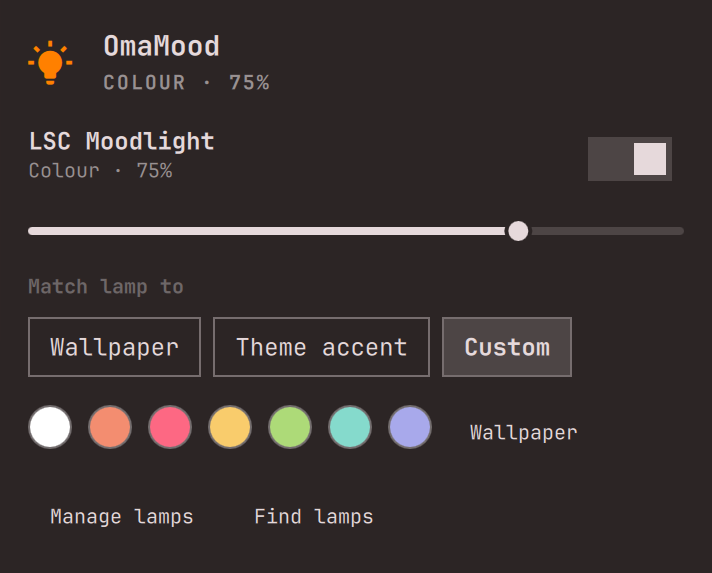

# OmaMood

Your Tuya Wi-Fi lamp in the [Omarchy](https://omarchy.org) bar. Power,
brightness and colour from the panel or keys; the lamp follows your wallpaper
when you change themes, and switches off while the computer sleeps and comes
back as it was when it wakes.

<p align="center"></p>

- **Local.** Commands go straight to the lamp over your LAN. The cloud is used
  once, to fetch the lamp's key, and the session is logged out right after.
- **No developer account.** Setup is one QR scan in the Smart Life app.
- **Nothing to install.** Python standard library, ImageMagick and qrencode:
  all already part of Omarchy.

For lamps that use the Smart Life / Tuya Smart app or a rebrand of it (LSC
Smart Connect and others). Tested on the LSC Mood Light; other Tuya lights with
the standard data points should work through the generic profiles. See
[Lamps](#lamps) for what has been confirmed, and add yours.

## Install

```bash
omarchy plugin add https://github.com/defkode/omarchy-moodlight --enable
```

A bulb appears in the bar. Update later with
`omarchy plugin update io.github.defkode.omamood && omarchy restart shell`.

## Set up your lamps

1. The lamp must already be paired in **Smart Life** (or Tuya Smart) on your phone.
2. In the app: **Me → ⚙ Settings → Account and Security → User Code**.
3. Click the bulb in the bar, type the User Code, press **Show QR**.
4. In the app: **+ → Scan**, scan the code, tap **Confirm login**. The app
   names the login "Home Assistant": OmaMood uses the same public sign-in that
   Home Assistant's official Tuya integration does, so no developer account is
   needed. You can remove it in the app afterwards; the lamps keep working.
5. OmaMood finds the lamps on your network and lists them.
6. Click **Install** next to "Theme hook not installed" so lamps follow theme changes.

Keys are stored in `~/.config/omamood/devices.json`, readable only by you.

Prefer the terminal? `~/.config/omarchy/plugins/io.github.defkode.omamood/omamood setup qr`.
Already have a local key (e.g. from `tinytuya wizard`)?
`omamood setup manual --id DEVICE_ID --key LOCAL_KEY [--ip IP] --name "Desk lamp"`.

## Use

- **Bar icon:** click for the panel, right-click to toggle, scroll for brightness.
  The bulb takes the lamp's colour.
- **Panel:** per lamp power and brightness; *Match lamp to* (what theme changes
  colour the lamp from); and, when that is *Custom*, swatches: white (the lamp's
  warm white) and your theme's colours, plus the current wallpaper's colour; what to match the lamp to when the theme changes.
  **Manage lamps** adds lamps (QR) or removes them (Remove → Confirm?). Keys: `Space` toggles, `←/→` brightness, `Esc` closes.
- **Theme change:** lamps that are on take the new wallpaper's main colour (or the
  theme accent). Muted palettes are made more saturated so they still read as a
  colour on an LED; grey wallpapers give white.
- **Sleep:** lamps switch off before the computer suspends and return to exactly
  what they were after it wakes (`sleepAction`).

### Keybindings

Plugins can't add keybindings, so paste what you want into `~/.config/hypr/bindings.lua`:

```lua
o.bind("SUPER + ALT + L", "Toggle lamps", "omarchy-shell -q omamood toggle")
o.bind("SUPER + ALT + SHIFT + L", "Lamps panel", "omarchy-shell shell toggle io.github.defkode.omamood")
```

Other verbs: `on off brighter dimmer white wallpaper accent blink`, and
`color '#ff8800'`.

### Command line and scripts

```bash
alias omamood=~/.config/omarchy/plugins/io.github.defkode.omamood/omamood
omamood status
omamood color orange --brightness 40
omamood blink --color '#00ff00'          # e.g. at the end of a long job: make && omamood blink
omamood timer 30
omamood remove "Desk lamp"               # forget a lamp and its key
omamood status --json                    # for scripts and AI agents
```

### Settings

In the panel, or `omarchy bar set io.github.defkode.omamood <key> <value>`:

| key | default | |
|:--|:--|:--|
| `colorSource` | `wallpaper` | what to match the lamp to on theme change: `wallpaper`, `accent` (theme accent) or `off` (Custom: you pick) |
| `saturationFloor` | `70` | minimum saturation (%) for theme colours |
| `sleepAction` | `off` | turn lamps off before suspend, restore after; `none` to leave them |
| `tintIcon` | `true` | colour the bar icon |

## Lamps

| Lamp | Protocol | Tested by | Notes |
|:--|:--|:--|:--|
| LSC Smart Connect Mood Light RGB+WW (Action 3204432) | 3.3 | @defkode | white is fixed 3000K |
| Other Tuya lights with standard DPs 20-28 | 3.3 | — | generic profile `tuya-light-v2` |
| Older Tuya bulbs with DPs 1-5 | 3.3 | — | generic profile `tuya-light-v1` |

Yours works too? Add it to this table: [docs/ADDING_DEVICES.md](docs/ADDING_DEVICES.md)
(or ask your coding agent to run the `add-device` skill). Lamps on Tuya
protocol 3.4/3.5 are not supported yet.

## Troubleshooting

- **"Offline" / IP changed:** panel → **Find lamps** (or `omamood discover`). A
  DHCP reservation in your router keeps the IP stable.
- **Not found during setup:** the lamp and this computer must be on the same
  network (not a guest network). Firewalls are fine: OmaMood only makes outgoing
  connections.
- **Doesn't follow themes:** panel shows "Theme hook not installed" → **Install**.
- **Logs:** `journalctl -t omarchy-shell | grep -i omamood`, and
  `omarchy-shell omamood status | python3 -m json.tool`.

## Contributing

`tools/check` runs everything. [AGENTS.md](AGENTS.md) is the short guide (for
people and coding agents alike); [BRIDGE.md](BRIDGE.md) the helper's contract.

MIT licence. The Tuya protocol work stands on the shoulders of
[tinytuya](https://github.com/jasonacox/tinytuya) and
[tuya-device-sharing-sdk](https://github.com/tuya/tuya-device-sharing-sdk).
